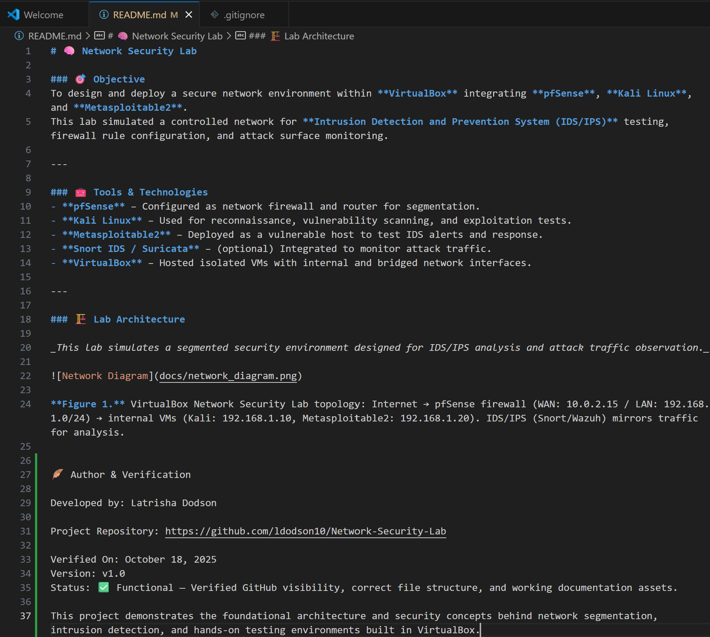

# 🧠 Network Security Lab

### 🎯 Objective
To design and deploy a secure network environment within **VirtualBox** integrating **pfSense**, **Kali Linux**, and **Metasploitable2**.  
This lab simulated a controlled network for **Intrusion Detection and Prevention System (IDS/IPS)** testing, firewall rule configuration, and attack surface monitoring.

---

### 🧰 Tools & Technologies
- **pfSense** – Configured as network firewall and router for segmentation.
- **Kali Linux** – Used for reconnaissance, vulnerability scanning, and exploitation tests.
- **Metasploitable2** – Deployed as a vulnerable host to test IDS alerts and response.
- **Snort IDS / Suricata** – (optional) Integrated to monitor attack traffic.
- **VirtualBox** – Hosted isolated VMs with internal and bridged network interfaces.

---

### 🏗️ Lab Architecture

_This lab simulates a segmented security environment designed for IDS/IPS analysis and attack traffic observation._

**Figure 1.** VirtualBox Network Security Lab topology: Internet → pfSense firewall (WAN: 10.0.2.15 / LAN: 192.168.1.0/24) → internal VMs (Kali: 192.168.1.10, Metasploitable2: 192.168.1.20). IDS/IPS (Snort/Wazuh) mirrors traffic for analysis.

### 🧾 Final Verification Evidence

| Description                               | File Name                                                |
|-------------------------------------------|----------------------------------------------------------|
| Finalized README with author footer       | `Local_README_Final_Verification_NetworkSecurityLab.png` |
| Successful GitHub push confirmation       | `GitHub_Push_Success_NetworkSecurityLab.png`             |
| README with Verification Section included | `Local_README_With_VerificationSection_NetworkSecurityLab.png` |

**Verification Screenshots**

  
  

🪶 Author & Verification

Developed by: Latrisha Dodson

Project Repository: https://github.com/ldodson10/Network-Security-Lab

Verified On: October 18, 2025
Version: v1.0
Status: ✅ Functional — Verified GitHub visibility, correct file structure, and working documentation assets.

This project demonstrates the foundational architecture and security concepts behind network segmentation, intrusion detection, and hands-on testing environments built in VirtualBox.